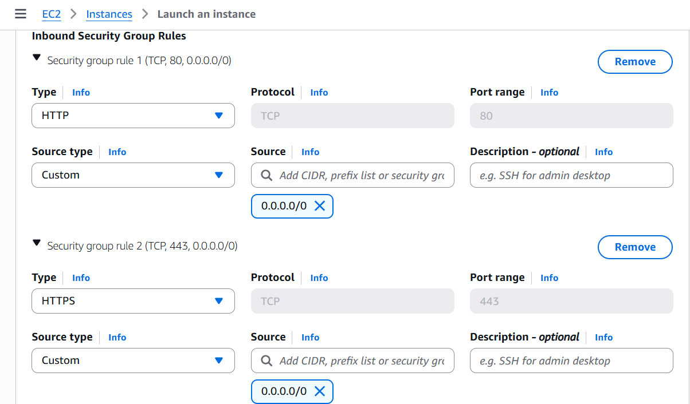
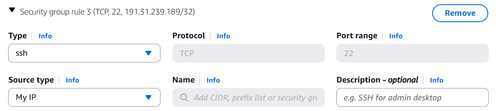
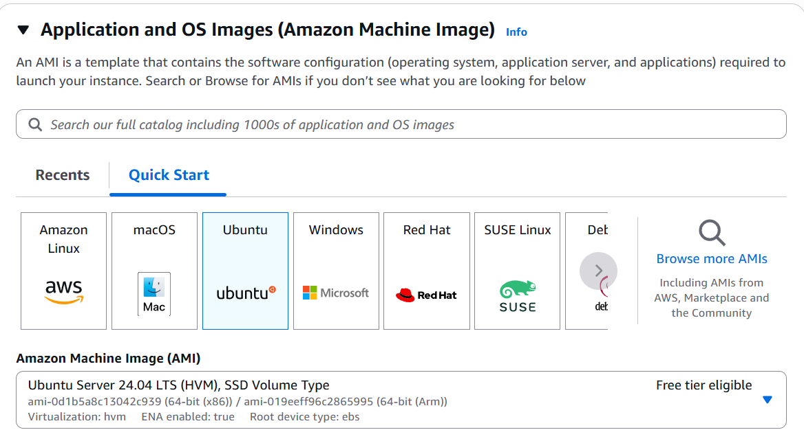
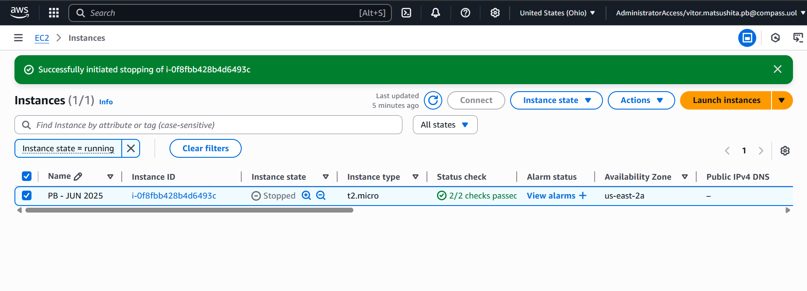
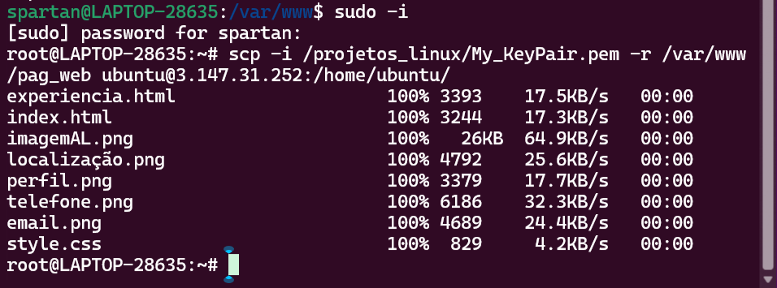
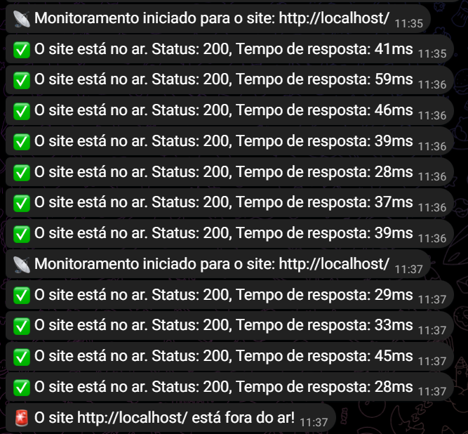
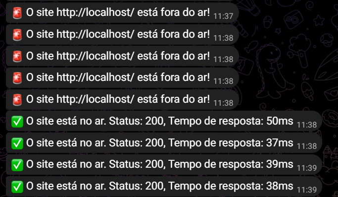
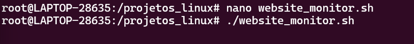
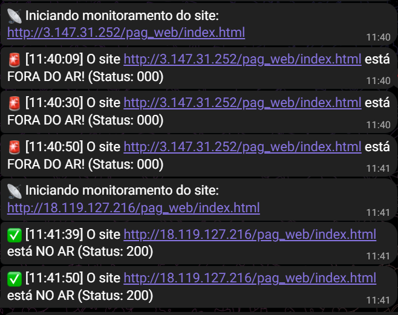
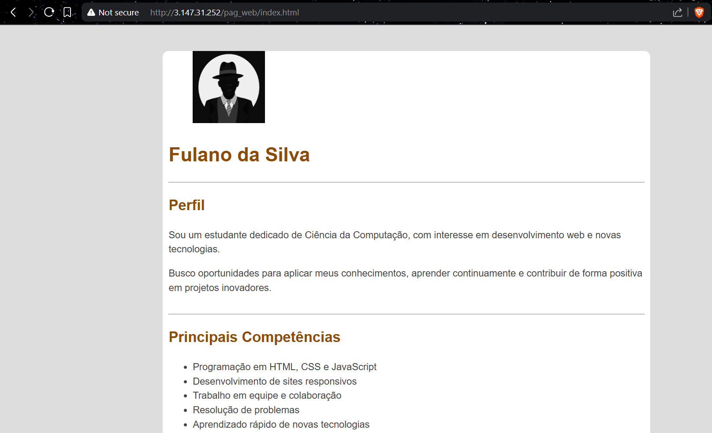

# Projeto-Linux---Compass-Uol
Primeiro Projeto de Linux - Compass Uol

## 📑 Índice

- [Alocação de Recursos](#alocação-de-recursos)
  - [VPCs](#vpcs)
  - [EC2](#ec2)
  - [Criação do Bot (Telegram)](#criação-do-bot-escolha-bot-no-telegram)
- [Conexão com a Instância EC2](#conexão-com-a-instancia-ec2)
- [Instalação e Configuração do Nginx](#instalação-e-configuração-do-nginx)
  - [Colocando a Página Web](#colocando-a-página-web)
- [Script Bash de Monitoramento](#script-bash-de-monitoramento)
- [Explicação do Código](#explicação-do-código)
  - [Início do Monitoramento](#inicio-do-monitoramento)
  - [Loop de Monitoramento](#loop-de-monitoramento)
  - [Site fora do Ar](#site-fora-do-ar)
  - [Site no Ar](#site-no-ar)
- [Bot de Monitoramento (Telegram)](#bot-de-monitoramento-telegram)


## Alocação de Recursos

### VPCs

- Foram criados 1 VPC com 2 Subnets Publicas, alocadas em 2 *Avaliable Zonas* diferentes de Ohio, para casos de problemas infraestruturais
- 2 Subnets Privadas alocadas em duas *Avaliable Zonas* diferentes de Ohio

### EC2

- Foi criado uma Instancia com, AMI (Ubuntu)
- Instancia Tipo t2.micro
- E foi criado um Key Pair (Arquivo.pem).
- Security Group
    - SSH com a origem My IP;
    - HTTP com origem Anywhere;










- Alocação do IP Dinâmica;
    - A cada nova inicialização, um novo IP público é associado.

___

### Criação do Bot (Escolha Bot no Telegram)
- Criação do Bot pelo BotFather

___
## Conexão com a Instancia EC2

```bash
ssh -i /caminho/para/chave.pem ubuntu@IP_DA_INSTANCIA

```

## Instalação e Configuração do Nginx

```bash
sudo apt update
sudo apt install nginx -y

sudo systemctl start nginx
sudo systemctl enable nginx

sudo systemctl status nginx
```

### Colocando a Página Web

Comando para passar a pasta do meu Ubuntu para a EC2:



- Colocando a pagina no root do nginx da EC2:

```
sudo chown -R www-data:www-data /var/www/html/pag_web
```
- **sudo**: executa o comando como superusuário (root), necessário para alterar permissões em /var/www.

- **chown**: change owner, ou seja, muda o dono da pasta.

- **-R**: aplica recursivamente (pasta e todos os arquivos/subpastas).

- **www-data:www-data**: define o usuário e grupo que serão donos da pasta.

- **/var/www/html/pag_web**: é a pasta da sua página web.
___

```
sudo chmod -R 755 /var/www/html/pag_web
```
- chmod: change mode, ou seja, altera as permissões.

- -R: recursivo (em tudo dentro da pasta).

- 755: define permissões como:

- 7 (rwx) para o dono (leitura, escrita, execução),

- 5 (r-x) para grupo (leitura e execução),

- 5 (r-x) para outros (leitura e execução).

- /var/www/html/pag_web: pasta que receberá essas permissões.

Link: http://<ip_elastico>/pag_web/index.html (IP elastico não mais associado)
___
## Script Bash de Monitoramento

⇒ Troca para URL do site no EC2:

```bash
#!/bin/bash

# === CONFIGURAÇÕES ===
#SITE="http://localhost/"   # Site a ser monitorado
SITE="http://IP_INSTANCE/pag_web/index.html"
INTERVALO=60                                    # Intervalo entre verificações (segundos)
LOG="/var/log/website_monitor.log"              # Caminho do arquivo de log
BOT_TOKEN="..."
CHAT_ID="..."

# === MENSAGEM DE INÍCIO ===
echo "Monitorando $SITE..." >> "$LOG" 2>&1
curl -s -X POST "https://api.telegram.org/bot$BOT_TOKEN/sendMessage" \
  -d chat_id="$CHAT_ID" -d text="📡 Iniciando monitoramento do site: $SITE" > /dev/null 2>&1

# === LOOP DE MONITORAMENTO ===
while true; do
  HORA=$(date +"%H:%M:%S")

  # Faz a requisição com timeout de 10s
  STATUS=$(curl -s --max-time 10 -o /dev/null -w "%{http_code}" "$SITE")

  # Se não recebeu resposta, trata como fora do ar ou erro
  if [ -z "$STATUS" ] || [ "$STATUS" != "200" ]; then
    echo "$HORA - Site fora do ar! (Status: ${STATUS:-sem resposta})" >> "$LOG" 2>&1
    curl -s -X POST "https://api.telegram.org/bot$BOT_TOKEN/sendMessage" \
      -d chat_id="$CHAT_ID" \
      -d text="🚨 [$HORA] O site $SITE está FORA DO AR! (Status: ${STATUS:-sem resposta})" > /dev/null 2>&1
  else
    echo "$HORA - Site no ar (Status: $STATUS)" >> "$LOG" 2>&1
    curl -s -X POST "https://api.telegram.org/bot$BOT_TOKEN/sendMessage" \
      -d chat_id="$CHAT_ID" \
      -d text="✅ [$HORA] O site $SITE está NO AR (Status: $STATUS)" > /dev/null 2>&1
  fi

  # Aguarda próximo ciclo
  sleep "$INTERVALO"
done
```
## Explicação do Código:

```
SITE="http://<ip_elastico>/pag_web/index.html"
```
- Definição do URL do site a ser monitorado
___
```
INTERVALO=60
```
- Intervalo de tempo entre as verificações
___
```
LOG="/var/log/website_monitor.log"
```
- Caminho onde o log sera salvo
___
```
BOT_TOKEN="..."  # token do seu bot do Telegram
CHAT_ID="..."    # ID do seu chat no Telegram
```
- Informações do bot Telegram
___
### Inicio do Monitoramento:
```
echo "Monitorando $SITE..." >> "$LOG" 2>&1
```
- Grava no log.
- **>> &LOG**: Direciona a saída do comando echo para o final do arquivo log.
- **2>&1**: Direciona qualquer erro do echo também para o arquivo log.

```
curl -s -X POST "https://api.telegram.org/bot$BOT_TOKEN/sendMessage" \
  -d chat_id="$CHAT_ID" -d text="📡 Iniciando monitoramento do site: $SITE" > /dev/null 2>&1

```
- Envia uma mensagem inicial via Telegram, avisando que o monitoramento começou.

- **curl -s** → modo silencioso (Não mostra progresso e erros no terminal).

- **X POST** → método HTTP POST.

- **d** → dados do corpo da requisição.

- **"${BOT_TOKEN}"** token do bot é inserido na URL.
___
### Loop de Monitoramento
```
while true; do
```
___
- Inicio do Loop
  
```
HORA=$(date +"%H:%M:%S")
```
- Salva a hora atual no formato: Horas, Minutos, Segundos.
___
```
STATUS=$(curl -s --max-time 10 -o /dev/null -w "%{http_code}" "$SITE")
```
- Realiza a requisição HTTP para o site:

- **curl**: comando para transferências de dados com URLs. 

- **-s** → modo silencioso (Não mostra progresso e erros no terminal).

- **--max-time 10** → espera no máximo 10 segundos.

- **-o /dev/null** → descarta o conteúdo da resposta (não precisamos do HTML).

- **-w "%{http_code}"** → imprime apenas o código de status HTTP.

- O resultado (ex: 200, 403, 000) é armazenado na variável STATUS.
___
### Site fora do Ar

```
if [ -z "$STATUS" ] || [ "$STATUS" != "200" ]; then
```
- Condição do Site Fora do Ar:
    - STATUS está vazio (-z) → ou seja, nenhuma resposta.
    - Ou o status não é 200 (OK).
    - Se qualquer uma for verdadeira, o site está fora do ar.
___
```
echo "$HORA - Site fora do ar! (Status: ${STATUS:-sem resposta})" >> "$LOG" 2>&1
```
- Caso o site esteja fora do ar:
    - Grava no arquivo log uma mensagem com o horário e status retornado.
___
```
curl -s -X POST "https://api.telegram.org/bot$BOT_TOKEN/sendMessage" \
  -d chat_id="$CHAT_ID" \
  -d text="🚨 [$HORA] O site $SITE está FORA DO AR! (Status: ${STATUS:-sem resposta})"
```
- Envia uma mensagem de alerta para o Telegram, informando que o site está fora do ar.
___
### Site no Ar
```
else
   echo "$HORA - Site no ar (Status: $STATUS)" >> "$LOG" 2>&1
```
- Grava e exibe a mensagem de sucesso com o horário no telegram.
```
    curl -s -X POST "https://api.telegram.org/bot$BOT_TOKEN/sendMessage" \
      -d chat_id="$CHAT_ID" \
      -d text="✅ [$HORA] O site $SITE está NO AR (Status: $STATUS)" > /dev/null 2>&1
```
- Envia uma mensagem positiva para o Telegram, confirmando que o site está acessível.
___
```
sleep "$INTERVALO"
```
- Aguarda o tempo definido (em segundos) antes de repetir o loop.
___
```
done
```
- Fim do Loop

## Bot de Monitoramento (Telegram):

- Teste com site, localmente:
- **Obs:** Para testes foi utilizado um intervalo de 10-15 segundos.





### Teste com Site na EC2:






